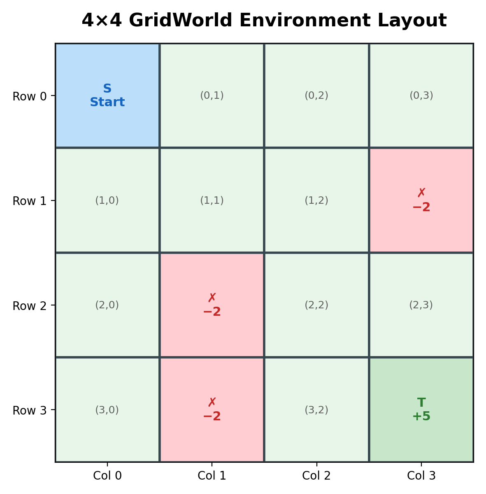
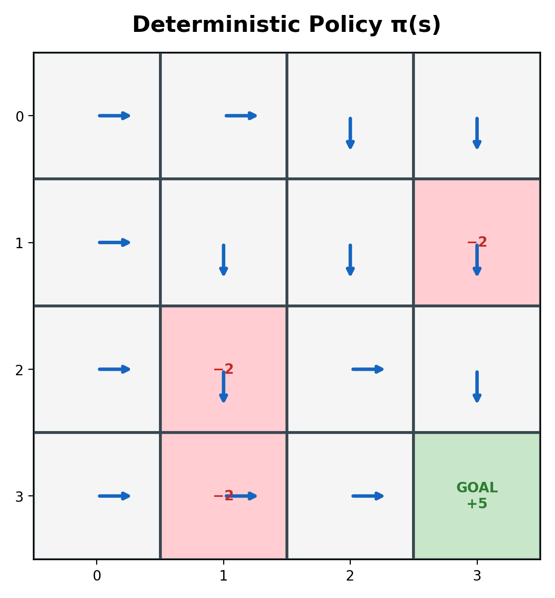
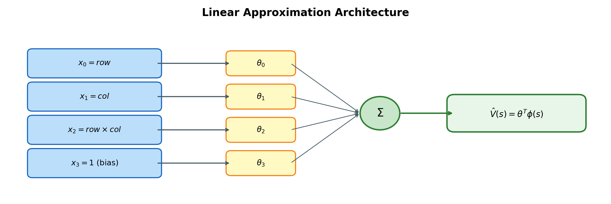
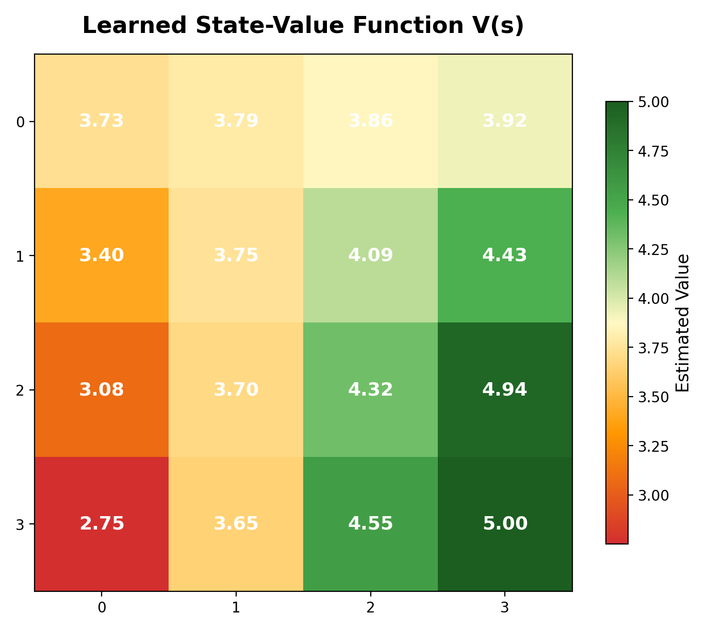
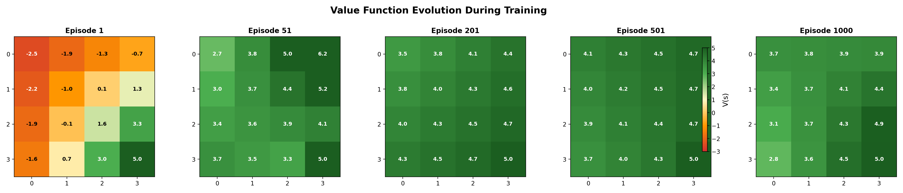
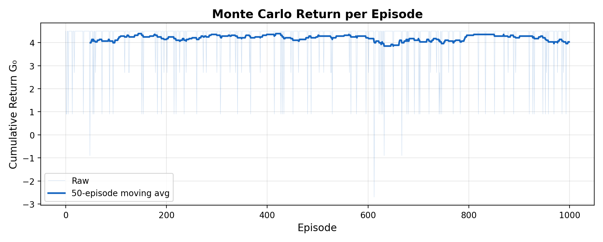
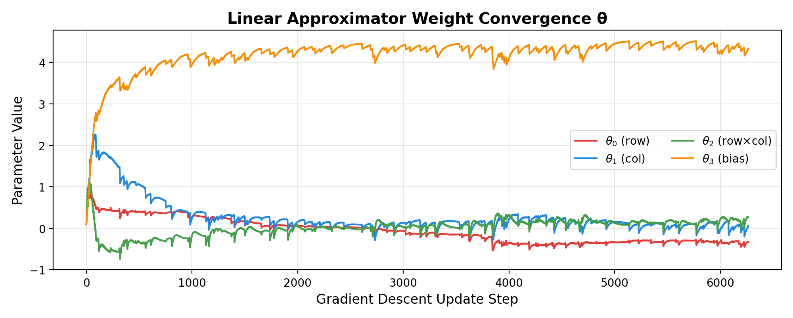
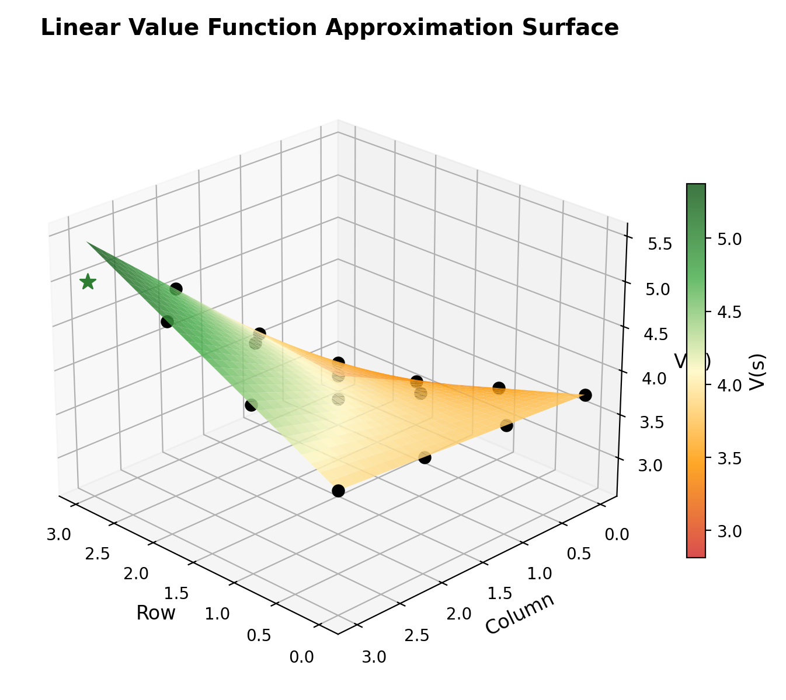
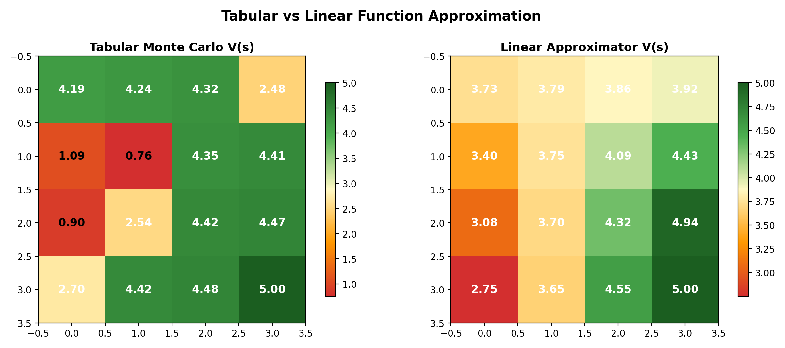
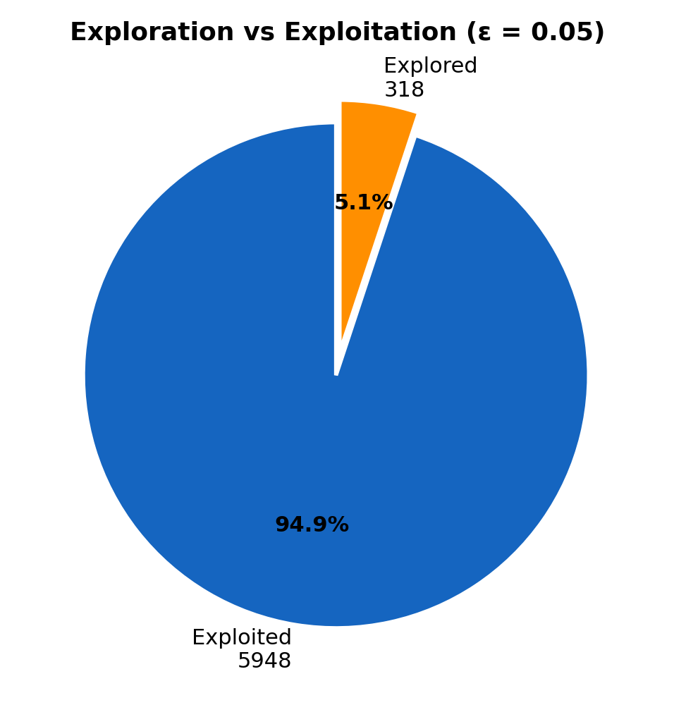

<div align="center">

# Monte Carlo Policy Evaluation with Linear Function Approximation

### Solving a 4×4 GridWorld via First-Visit MC & Stochastic Gradient Descent

[](https://python.org)
[](https://numpy.org)
[](https://matplotlib.org)
[](https://opensource.org/licenses/MIT)
[]()

<br>

*A from-scratch implementation demonstrating how a **4-parameter linear model** can generalize across a 16-state MDP — replacing a full tabular value table with a compact, differentiable approximator trained via Monte Carlo returns and gradient descent.*

</div>

---

## Table of Contents

- [Motivation](#motivation)
- [Environment](#environment)
- [Method](#method)
- [Linear Function Approximation Architecture](#linear-function-approximation-architecture)
- [Results & Analysis](#results--analysis)
- [Mathematical Formulation](#mathematical-formulation)
- [Installation & Usage](#installation--usage)
- [Key Insights](#key-insights)
- [Project Structure](#project-structure)
- [References](#references)

---

## Motivation

Tabular reinforcement learning methods store one value per state — a strategy that collapses under the **curse of dimensionality** when state spaces grow large. Function approximation provides a scalable alternative: instead of memorizing values, we learn a **parameterized function** that generalizes across states.

This project strips the concept down to its essence: a **4×4 GridWorld** paired with a **4-weight linear model**, trained with **first-visit Monte Carlo** returns. The simplicity is intentional — it provides a transparent window into the mechanics of value function approximation, gradient-based updates, and the trade-offs between representational capacity and generalization.

> **Why this matters at scale:** The same linear approximation + SGD pipeline underpinning this 4-parameter toy model is the conceptual backbone of deep RL systems with millions of parameters — from AlphaGo's value network to modern RLHF reward models.

---

## Environment

<div align="center">



</div>

A 4×4 grid MDP with deterministic transitions:

| Property | Detail |
|---|---|
| **State space** | 16 cells `(row, col)` — 15 non-terminal + 1 terminal |
| **Action space** | `{Up, Down, Left, Right}` — boundary-aware |
| **Start state** | `(0, 0)` — top-left corner |
| **Terminal state** | `(3, 3)` — bottom-right corner, reward **+5** |
| **Penalty cells** | `(1,3)`, `(2,1)`, `(3,1)` — reward **−2** each |
| **Default reward** | 0 for all other transitions |
| **Discount factor** | γ = 0.9 |

---

## Method

<div align="center">

```
┌─────────────┐     ┌──────────────────┐     ┌────────────────────┐     ┌──────────────┐
│  Generate    │────▶│  Compute MC      │────▶│  SGD Update on     │────▶│  Improved    │
│  Episode     │     │  Returns G_t     │     │  Linear Weights θ  │     │  V̂(s; θ)    │
└─────────────┘     └──────────────────┘     └────────────────────┘     └──────────────┘
       ▲                                                                        │
       └────────────────────────────────────────────────────────────────────────┘
                                    × 1000 episodes
```

</div>

**Algorithm: First-Visit Monte Carlo with Linear Function Approximation**

1. **Initialize** weight vector θ ∈ ℝ⁴ with small values (0.1)
2. **For each episode** (ε-greedy, ε = 0.05):
   - Generate a trajectory following policy π with exploration
   - Compute discounted cumulative returns G for each first visit
3. **For each visited state** in the trajectory:
   - Extract feature vector φ(s) from state coordinates
   - Update θ via SGD: θ ← θ + α(G − θᵀφ(s))∇_θ θᵀφ(s)

<div align="center">



</div>

The deterministic base policy routes the agent from Start `(0,0)` toward the Goal `(3,3)` while an ε-greedy wrapper (ε = 0.05) injects stochastic exploration to ensure sufficient state coverage.

---

## Linear Function Approximation Architecture

<div align="center">



</div>

The value function is approximated as a **linear combination** of hand-crafted features:

$$\hat{V}(s;\theta) = \theta_0 (r - 1) + \theta_1 (c - 1.5) + \theta_2 (rc - 3) + \theta_3$$

where `r` = row index, `c` = column index, and the features are **mean-centered** for stable gradient dynamics.

| Feature | Formula | Intuition |
|---|---|---|
| φ₀ | `row − 1` | Vertical position (proximity to goal row) |
| φ₁ | `col − 1.5` | Horizontal position (proximity to goal column) |
| φ₂ | `row × col − 3` | Interaction term (diagonal proximity to goal corner) |
| φ₃ | `1` | Bias / baseline value |

**Only 4 learnable parameters** approximate 15 state values — a **73% compression** compared to tabular storage, achieved through structural assumptions about the value landscape.

---

## Results & Analysis

### Learned Value Function

<div align="center">



</div>

The learned values show a clear **gradient toward the terminal state** `(3,3)` with reward +5, demonstrating that the linear model successfully captures the spatial structure of optimal returns. States closer to the goal carry higher value, while the top-left region (farthest from reward) has the lowest estimated values.

**Converged Parameters:**

| Parameter | Value | Interpretation |
|---|---|---|
| θ₀ | −0.326 | Each row closer to goal slightly decreases raw value (offset by interaction) |
| θ₁ | +0.065 | Rightward movement marginally increases value |
| θ₂ | +0.278 | **Dominant term** — diagonal proximity to (3,3) drives value |
| θ₃ | +4.334 | Strong positive bias reflecting the +5 terminal reward |

### Value Function Evolution During Training

<div align="center">



</div>

The value landscape transitions from a flat initialization to a structured gradient over 1,000 episodes, with the bulk of learning occurring in the first 200 episodes.

### Training Dynamics

<div align="center">



</div>

Episode returns stabilize rapidly, confirming convergence of the Monte Carlo estimation process under the fixed policy.

### Weight Convergence

<div align="center">



</div>

All four parameters converge smoothly to their final values, with the bias term θ₃ dominating (reflecting the global +5 reward signal) and the interaction term θ₂ capturing the spatial gradient toward the goal.

### 3D Value Surface

<div align="center">



</div>

The continuous linear surface interpolated across the grid reveals the planar nature of the approximation — a deliberate simplification that trades local accuracy for global generalization. The surface tilts upward toward `(3,3)`, confirming that the model has learned the correct reward gradient.

### Tabular vs. Linear Approximation

<div align="center">



</div>

Comparing tabular Monte Carlo (exact, per-state averages) against the linear approximator highlights the **bias-variance trade-off**:
- **Tabular**: Zero bias, captures penalty cells precisely, but requires 15 independent estimates
- **Linear**: Introduces structural bias (can't represent arbitrary value landscapes) but generalizes from only 4 parameters, providing smoother value estimates

### Exploration vs. Exploitation

<div align="center">



</div>

With ε = 0.05, the agent exploits its policy ~95% of the time while maintaining enough exploration to visit diverse state-action pairs — a balance that ensures reliable return estimates without sacrificing sample efficiency.

---

## Mathematical Formulation

**Monte Carlo Return** (first-visit, per-episode):

$$G_t = \sum_{k=0}^{T-t-1} \gamma^k R_{t+k+1}$$

**Linear Value Approximation:**

$$\hat{V}(s; \theta) = \theta^\top \phi(s) = \sum_{i=0}^{3} \theta_i \phi_i(s)$$

**Stochastic Gradient Descent Update:**

$$\theta \leftarrow \theta + \alpha \left[ G_t - \hat{V}(S_t; \theta) \right] \nabla_\theta \hat{V}(S_t; \theta)$$

where for the linear case:

$$\nabla_\theta \hat{V}(s; \theta) = \phi(s)$$

This yields the **LMS (Least Mean Squares)** update rule — the simplest instance of the broader family of policy evaluation algorithms with function approximation (Sutton & Barto, Chapter 9).

---

## Installation & Usage

```bash
# Clone the repository
git clone https://github.com/YOUR_USERNAME/Reinforcement-Learning-solving-a-4-by-4-Gridworld-MonteCarlo-by-linear-approximator-in-python.git
cd Reinforcement-Learning-solving-a-4-by-4-Gridworld-MonteCarlo-by-linear-approximator-in-python

# Install dependencies
pip install numpy matplotlib

# Run the main simulation
python "linear model approximation monte carlo grid world.py"

# Regenerate all visualizations
python generate_plots.py
```

**Requirements:**

| Package | Version |
|---|---|
| Python | ≥ 3.8 |
| NumPy | ≥ 1.20 |
| Matplotlib | ≥ 3.4 |

---

## Key Insights

1. **Compression Power**: 4 parameters faithfully approximate 15 state values — demonstrating that structural priors about the value landscape can dramatically reduce model complexity.

2. **Feature Engineering Matters**: The mean-centered polynomial features (row, col, row×col, bias) are not arbitrary — they encode the geometric intuition that value should increase toward the bottom-right goal. This is the linear-model analog of choosing the right architecture in deep RL.

3. **Smooth Generalization**: Unlike tabular methods that treat each state independently, the linear approximator shares information across states. Updating V(2,2) implicitly adjusts V(2,3) and V(3,2) — a property that becomes critical in large state spaces.

4. **Convergence Guarantees**: Under a fixed policy with linear function approximation, Monte Carlo with SGD converges to the **minimum MSE solution** within the representable function class (the TD fixed point for MC is the least-squares projection).

5. **Foundation for Deep RL**: Replace the 4-dimensional feature vector with a neural network's learned representations, and this exact algorithm becomes the value estimation backbone of modern deep RL — from DQN to PPO's critic network.

---

## Project Structure

```
├── linear model approximation monte carlo grid world.py   # Core implementation
├── generate_plots.py                                       # Visualization & analysis pipeline
├── assets/                                                 # Generated figures
│   ├── gridworld_environment.png                           # Environment layout
│   ├── policy_visualization.png                            # Policy arrows
│   ├── value_function_heatmap.png                          # Final V(s) heatmap
│   ├── value_evolution.png                                 # V(s) across training
│   ├── training_returns.png                                # Episode return curve
│   ├── theta_convergence.png                               # Weight trajectories
│   ├── exploration_exploitation.png                        # ε-greedy breakdown
│   ├── value_surface_3d.png                                # 3D value surface
│   ├── tabular_vs_linear.png                               # Method comparison
│   └── architecture_diagram.png                            # Model architecture
└── README.md                                               # This file
```

---

## References

1. **Sutton, R. S., & Barto, A. G.** (2018). *Reinforcement Learning: An Introduction* (2nd ed.). MIT Press. — Chapters 5 (Monte Carlo Methods) & 9 (On-policy Prediction with Approximation).

2. **Tsitsiklis, J. N., & Van Roy, B.** (1997). An analysis of temporal-difference learning with function approximation. *IEEE Transactions on Automatic Control*, 42(5), 674-690.

3. **Bertsekas, D. P., & Tsitsiklis, J. N.** (1996). *Neuro-Dynamic Programming*. Athena Scientific.

4. **Mnih, V., et al.** (2015). Human-level control through deep reinforcement learning. *Nature*, 518(7540), 529-533. — Extends linear approximation to deep networks (DQN).

---

<div align="center">

**Built from first principles — no frameworks, no black boxes.**

*Pure NumPy implementation for maximum transparency into the learning dynamics.*

<br>

<sub>Developed as part of ongoing research into scalable value function approximation methods in reinforcement learning.</sub>

</div>
